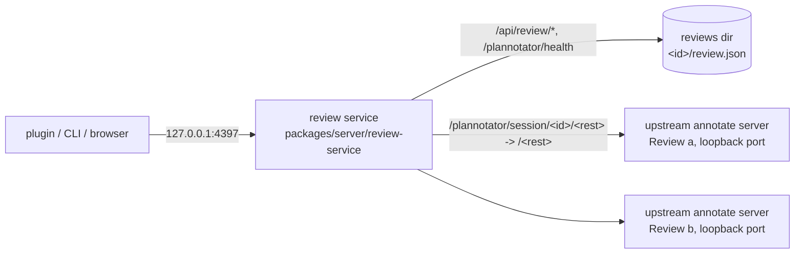

## Context

Story 3 of `epic-plannotator-service`. Upstream serves one document per process: `apps/hook/server/index.ts` (`annotate` branch) resolves the target with `resolveAnnotateTarget` and calls `startAnnotateServer` (`packages/server/annotate.ts`), which binds a random port and keeps every bit of session state in one closure: the decision settler, the client lease, drafts keyed by content hash, version history, the agent terminal. The page is the plan editor single-file build (`apps/hook/dist/index.html`), embedded into the binary. The contract (story 2, `docs/review-api.md`, `@plannotator/shared/review-api`) fixes the service's paths, ids, link origins, parsers and the Host and Origin rule; a stub (`packages/server/review-api/stub.ts`) answers it with placeholder data.

## Goals / Non-Goals

**Goals:**
- `plannotator serve`: one server on 127.0.0.1:4397 (overridable) serving many Reviews at once.
- A lasting id per file, state per Review in its own folder, surviving restarts.
- The page under `/plannotator/session/<id>/` is upstream's plan page and handlers; `api/plan` returns that file's content.
- Health, version, open, list and Visibility per the contract.

**Non-Goals:**
- The page's own fetches under its base path (story 4). Until then the page's client calls root `/api/...`, which the service answers 404.
- Remarks and the listen socket (story 5), Rounds, Approve, Cancel and reopen (story 6), the CLI through the service (story 7), Replies (story 8), the public and temporary doors (stories 10, 11), launchd (story 12).

## Decisions

- **One upstream annotate server per Review, behind a path-forwarding service.** The service starts `startAnnotateServer` for a Review's document on the first request for its page, on a free loopback port, and forwards `/plannotator/session/<id>/<rest>` to `/<rest>` there, streaming the answer back (the client-lease SSE included). This answers the story's open question: none of the annotate server's closure state (decision, client lease, drafts) moves into a registry, because each Review has its own closure; no upstream server file changes. Rejected: refactoring `startAnnotateServer` into a portless per-Review request handler (rewrites a 1,400-line upstream file, conflicts on every release; ADR 0003); a new page for the service (drifts from upstream). Recorded as ADR 0005.
- **Pages start lazily and stay up.** A page starts on its first request, once however many requests race (one promise per Review); a failed start answers 502 `page failed to start: <reason>` and is forgotten, so the next request tries again. Pages stop with the service. Starting on open was rejected: a restart with many stored Reviews would start every server at once.
- **Pages run like `annotate <file> --gate`.** `apps/hook/server/serve-command.ts` resolves the file with upstream's `resolveAnnotateTarget` (Markdown, text, HTML, diagrams as upstream treats them) and starts the page with `gate: true` and `approvalNotesSupported: true` (the contract's Approve carries notes), the CLI's sharing settings, no client lease, no browser, no `~/.plannotator/sessions` entry and no blocking decision. What Approve and Send feedback do in the service is stories 5 and 6.
- **Ids.** `reviewIdForFile`: first 16 hex characters of the SHA-256 of `realpath(file)`, as the stub and Lavish do, so a symlink or a second open finds the same Review.
- **Storage.** `<reviews dir>/<review_id>/review.json` holds `review_id`, `file`, `visibility`, `round`, `state`, `round_opened_at`, `last_page_open` (`StoredReview`, a `Pick` of the contract's `Review`), written to a temp file and renamed. The folder is the Review's: later stories add Remarks, notices and Replies beside it. At start the store reads every folder named like a Review id; one that does not parse is skipped with a log line and left on disk. The list computes `link`, and reports `open_item_count` 0, `open_items` `[]` and `listeners` `[]`, which are true until stories 5 and 6 add Remarks and listeners.
- **Settings.** Port: `--port <n>` over `PLANNOTATOR_SERVICE_PORT` over 4397 (Lavish: `LAVISH_AXI_PORT`). Reviews dir: `PLANNOTATOR_REVIEWS_DIR` over `<getPlannotatorDataDir()>/reviews`, so `PLANNOTATOR_DATA_DIR` moves it with the rest of Plannotator's data (approach: `~/.plannotator/reviews/<id>/`). A bad setting exits 2 with the usage.
- **Process environment of serve.** The serve process sets `PLANNOTATOR_REMOTE=0` and drops `PLANNOTATOR_PORT`, because every page server reads them: pages bind loopback on free ports whatever shell started the service. It also changes directory to the reviews dir: upstream servers warm a file list of the working directory on start, and a service started from `~` must not walk the home folder per page.
- **`last_page_open`.** Set when the page path itself (`/plannotator/session/<id>/`) answers 200 through the service, not on its API calls. Story 5 sends the matching `page_open` event.
- **Trailing slash.** `/plannotator/session/<id>` redirects 308 to `/plannotator/session/<id>/`, so the page's relative calls (story 4) resolve under it.
- **Routes not built here answer 404 `not found`**, like any unknown route: `GET /api/review/v1/listen` (story 5), `POST .../:review_id/cancel` (story 6), `POST .../:review_id/replies` (story 8). Placeholder answers were rejected: the service would claim behaviour it does not have. Open never ends or reopens a Round (`reopen` is parsed and has no effect, `status` is always `opened`) until story 6 adds ended Rounds.
- **The stub stays for now.** The stub answers listen, Cancel and Replies with placeholder data, which epic 2's plugin builds against today. It is not grown into the service (its in-memory placeholders are not the real behaviour). The story that makes the service answer the last of those routes deletes `packages/server/review-api/stub.ts` and its docs section. `docs/review-api.md` says so.
- **Module placement (ADR 0003).** Fork-owned: `packages/server/review-service/` (`settings.ts`, `store.ts`, `pages.ts`, `service.ts`, `index.ts`, exported as `@plannotator/server/review-service`) and `apps/hook/server/serve-command.ts`. Upstream call sites: the `serve` branch in `apps/hook/server/index.ts` (one import, one branch), `"serve"` in `INTERNAL_SUBCOMMANDS` of `apps/hook/server/unknown-subcommand.ts` (internal, like `install-runtime`: run by the LaunchAgent, so upstream's skill freshness test does not demand a skill entry; `serve --help` prints its usage from the fork module), one export line in `packages/server/package.json`.
- **Instrumentation.** No logging facade exists in the fork; the service logs to stderr with upstream's `[plannotator]` prefix: the listening line with the Review count, each new Review, each page that fails to start, each skipped state folder.
- **Tests.** `packages/server/review-service/service.test.ts` runs the service against real upstream annotate servers: two documents, lasting ids (symlink included), `api/plan` per page, single page start under racing requests, restart from disk, list filter, Visibility kept, health and version, refusals, page start failure and retry, and settings precedence.

## Risks / Trade-offs

- [A loopback port per open page] -> pages start only when loaded; story 6 may stop a page when its Round ends.
- [Pages read the process working directory (reference roots, file browser root) and `closeAllFileBrowserWatchers()` on stop is process-wide] -> the working directory is the reviews dir; stopping one page before the service stops arrives with story 6, which must account for the shared watchers.
- [WebSockets are not forwarded (the upstream agent terminal)] -> the terminal is optional in the page; story 4 decides when it moves the page under its base path.
- [The page's client calls root `/api/...`] -> story 4.

## Migration Plan

None: a new subcommand. Nothing runs it until story 12 installs the LaunchAgent; the installed `~/.local/bin/plannotator` is untouched.

## Open Questions

None.
